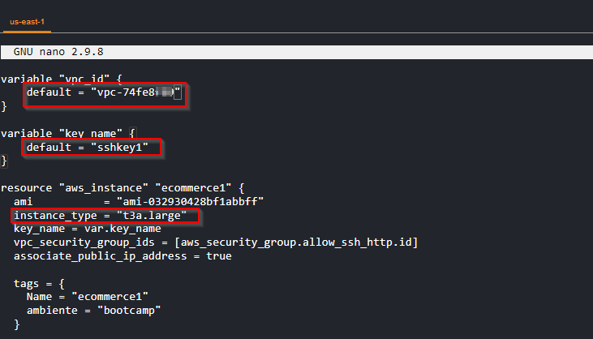
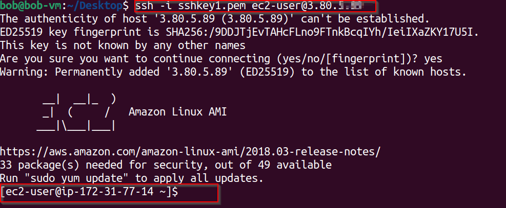
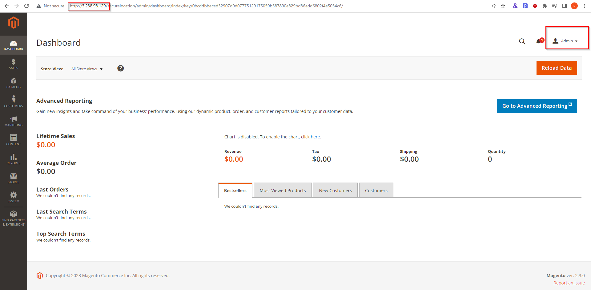

# E-COMMERCE MVP DEPLOYMENT

** Project Description**

In another project based in a real-world scenario, I worked as Cloud Engineer using DevOps, where I created and implemented an e-Commerce MVP (Minimum Viable Product) on AWS in less than 2 hours and in an automated way using Terraform and Ansible (Infrastructure as Code – IaC).

**SYSTEM DESIGN**


**Pre-requisites**
- Aws account 
- Magento account 
- Terraforms and ansible knowledge

To address this situation I provisioned the infrastructure in an automated way levaraging on the Terraform and Ansible to automate the configuration management process, software installation and package management of the EC2 instance. I also used Magento, PHP, MySQL, and Redis to complete this project.

let's get to it. 


**Step 1:Create Magento free account on**

Browse to the magento marketplace web site at https://marketplace.magento.com/ and create an account. Once done, login and navigate to MY profile, by clicking the dropdown arrow beside you account name. Create and Save the Public and Private Key from your Magento account.


Copy key and save for future use.


**Step 2: Install Terraform on AWS Cloud Shell**
Login on to your AWS console and open AWS cloud Shell and install terraform. 

```console
sudo yum install -y yum-utils
sudo yum-config-manager --add-repo https://rpm.releases.hashicorp.com/AmazonLinux/hashicorp.repo
sudo yum -y install terraform
```


**Step 3: Download the Terraform files on AWS Cloud Shell**

```console
mkdir final_project
cd final_project
wget https://tcb-bootcamps.s3.amazonaws.com/bootcamp-aws/en/final-project-terraform.zip
unzip final-project-terraform.zip
```


**Step 4: Edit Terraform files | variable**
In the aws CLi use nano editor to modify the variables in the `main.tf` file by replacing the Variable vpc_id and key_name with that of your aws environment in my case I use the default VPC and created a key called **sshkey1**. Save the file and exit when done.



**Step 5: Running Terraform to deploy the EC2 VM:**
This step should take some time to complete. 

```console
cd terraform
terraform init
terraform plan
terraform apply

It everything works correctly you should end up with the following screen.
```


YOu can also check your EC2 and see that the instance was created.


**Step 6: Connect to your EC2 instance via SSH**
```console
ssh -i sshkey1.pem ec2-user@x.x.x.x
```



**Step 7: Install Ansible in the EC2 VM**

```console
sudo yum-config-manager --enable epel
sudo yum install ansible -y
```


**Step 8: Download the Ansible playbooks**
```console
wget https://tcb-bootcamps.s3.amazonaws.com/bootcamp-aws/en/final-project-ansible-magento2.zip
unzip final-project-ansible-magento2.zip
```


**Step 9: Edit and save Ansible file parameters**
```console
cd ansible-magento2
```

File: group_vars/all.yml

* magento_domain
* server_hostname
* repo_api_key
* repo_secret_key


Edit the admin login credentials.

**Step 10: Run Ansible to deploy the stack of tools for the e-commerce**

```console
cd ..
ansible-playbook -i hosts.yml ansible-magento2.yml -k -vvv --become
```
This should take about 5 minute to complete. Just be patient.


**Step 11: Testing the E-commerce website**

Just copy and paste the EC2 Public IP in the browser.

*in some cases, it can take some minutes to get the website available!


**Step 12: Setting up the e-commerce:**

http://<EC2_PUBLIC_IP>/securelocation

User: Admin
Password: Strong123Password#


(User and Password of the Magento Admin available in the file: group_vars/all.yml)



**Step 13: Download the ecommerce images and personalize the ecommerce website.**
https://tcb-bootcamps.s3.amazonaws.com/bootcamp-aws/en/final-project-images.zip 

-- Content > Configuration > HTML Head > Edit (Default Store View)
--- Default page title: The Clodu Bootcamp Store
--- Header > Logo image: The Cloud Bootcamp logo from images
--- Header > Welcome text: Welcome to The Cloud Bootcamp Store!
--- Cache Refresh (Flush it)


let's try to add items to the site.

-- Catalog > Products > Add product > The Cloud Bootcamp T-Shirt
--- Price: 80
--- Quantity: 100
--- Images And Videos > Add images
--- Save


-- Content > Pages > Edit Home Pages
--- Click Content > Erase content

--- Insert Widget > Widget type: Catalog New Products List > Insert Widget


Take note, if you run in an erro trying to upload a images to the side, follow the instructions in this link to troubleshoot

https://community.magento.com/t5/Magento-2-x-Technical-Issues/Magento-2-3-0-Can-t-upload-logo-img/td-p/115196

GOOD LucK 

**Step 14: Check if the customization is in place**
click on the drop down menu beside admin and select customer view. 


- Remove the resources deployed via AWS Cloud Shell

(If needed, re-install the Terraform following the same steps used previously)

```console
cd ~/final_project/terraform
terraform destroy
```


The Cloud Bootcamp Team


Links:
Ansible Documentation: https://docs.ansible.com/ansible-core/devel/user_guide/index.html 